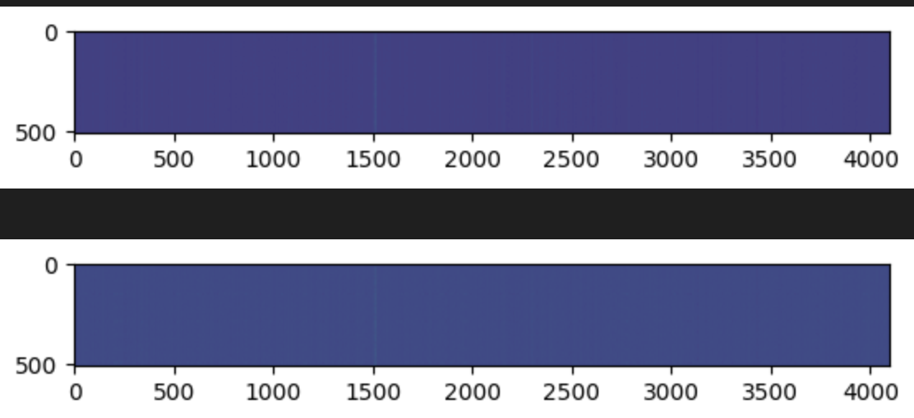

# LLM-Layer-Distillation


## 📌 Project Overview
LLM-Layer-Distillation is an experimental repository focused on two critical areas of LLM optimization: architectural distillation and grounded dataset generation.

This project uses layer-level knowledge distillation to replace expensive self-attention layers with sub-quadratic Hyena operators (fftconv). Target model activations serve as a cheap supervision signal to train the efficient sequence mixer.

Key findings:
* **The Hyena op converges and generalises:** Train loss is ~0.0003, test loss is ~0.00057, with no significant overfitting.
* **It learns from a tiny dataset:** The layer successfully learns from just 400 samples.
* **The training is stable:** The loss curve is flat and consistent, not noisy.

## Why This Project Exists
Standard transformer attention scales quadratically with sequence length, creating a memory and compute bottleneck for long contexts. This project explores whether that bottleneck can be bypassed cheaply — by training a sub-quadratic Hyena operator to mimic an existing attention layer's behaviour using only its saved input/output activations, without retraining the full model.

## 📊 Attention Visualisation

The image below shows attention maps over a 4,096-token context window. The near-uniform distribution across all positions illustrates the challenge standard attention faces with long documents — the signal is spread thin, making it hard for the model to attend to specific evidence.



This motivates the use of the Hyena operator, whose implicit convolutional filters can capture sparse, long-range dependencies more efficiently.

## Project Structure

```
.
├── data_download.ipynb     # Download Wikipedia & generate Q/A pairs via GPT-3.5-turbo
├── finetune_gen.ipynb      # Format training data with CONTEXT IDs and HIGHLIGHT tags
├── hyena.ipynb             # Hyena operator implementation (FFT conv, filters, HyenaOperator)
├── train_data.json         # Generated training pairs (context chunk + Q/A)
├── QA_pairs.json           # Raw Q/A pairs with article IDs and chunk indices
└── README.md
```

---
## Getting Started

### Prerequisites

- Python 3.10+
- PyTorch
- **Ollama** installed locally (with a model like `mistral` or `llama3` pulled)
- A Hugging Face account with access to `Qwen/Qwen2.5-7B`

### Installation

```bash
git clone https://github.com/nitesh-77/llm-layer-distillation.git
pip install torch transformers datasets openai einops
```

### Step 1 — Generate Training Data

Open `data_download.ipynb`. This notebook:

1. Downloads the English Wikipedia dataset (6.4M articles) via Hugging Face `datasets`
2. Splits each article into 2,000-character chunks
3. Calls a local state-of-the-art LLM (e.g., Llama 3 or Mistral via Ollama) to generate a specific, searchable Q/A pair for each chunk
4. Saves results incrementally to `QA_pairs.json`


> **Note:** The full Wikipedia dataset is large (~20GB). For quick experimentation, limit the loop in Cell 5 to the first few hundred articles.

### Step 2 — Format Fine-Tuning Batches

Open `finetune_gen.ipynb`. This notebook:

1. Loads the saved `train_data.json`
2. Tokenizes data using the `Qwen/Qwen2.5-7B` tokenizer
3. Formats batches with randomised `[CONTEXT <ID>]` blocks and citation instructions

The prompt format trains the model to answer questions and cite its source with `[HIGHLIGHT]` tags:

```
[CONTEXT 74821]
<wikipedia passage>
[/CONTEXT 74821]

Answer the following questions, providing highlighted text as evidence for your answer.
To cite and highlight, first link the [CONTEXT] block, then add [HIGHLIGHT] tags around the relevant text.
```

### Step 3 — The Hyena Operator

`hyena.ipynb` contains a standalone implementation of the Hyena sequence model layer. Key components:

| Component | Description |
|---|---|
| `fftconv` | FFT-based long convolution kernel |
| `PositionalEmbedding` | Complex exponential positional encoding |
| `ExponentialModulation` | Learnable decay applied to the filter |
| `HyenaFilter` | Implicit MLP-parameterised long filter |
| `HyenaOperator` | Full Hyena layer replacing multi-head attention |

The Hyena operator can be dropped in as a replacement for attention in any transformer-style architecture.

---

## 📄 License
This project is licensed under the **Apache License 2.0** (SPDX identifier: `Apache-2.0`).
See [LICENSE](LICENSE) for the full license text.

```text
Copyright 2026 Nitesh

Licensed under the Apache License, Version 2.0 (the "License");
you may not use this file except in compliance with the License.
You may obtain a copy of the License at

    [http://www.apache.org/licenses/LICENSE-2.0](http://www.apache.org/licenses/LICENSE-2.0)
